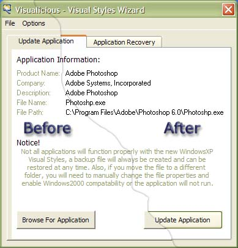



## Visualicious Visual Styles Wizard for WindowsXP

### Description

Update any portable executable (.exe's) to use the new Windows XP themes. Yeah, yeah yeah, ther are lots of manifest makers, creators and wizards, but none come close to Visualicious!! Whats different than my earlier version is that ther is no longer the need to include a manifest file with your final product(thanks to Mick Doherty). Visualicious actuall inserts the manifest into the .exe, there is a recovery feature that lets you restore any changes made by Visualicious. It is recomended that you first make a reference to CommonControls6, you can see how I did it when you view Visualicious' source.
 
### More Info
 

             |
---                |---
**Submitted On**   |2002-01-06 14:36:16
**By**             |[Hectotized](https://github.com/Planet-Source-Code/PSCIndex/blob/master/ByAuthor/hectotized.md)
**Level**          |Intermediate
**User Rating**    |4.7 (137 globes from 29 users)
**Compatibility**  |VB 6\.0
**Category**       |[Complete Applications](https://github.com/Planet-Source-Code/PSCIndex/blob/master/ByCategory/complete-applications__1-27.md)
**World**          |[Visual Basic](https://github.com/Planet-Source-Code/PSCIndex/blob/master/ByWorld/visual-basic.md)
**Archive File**   |[Visualicio47132182002\.zip](https://github.com/Planet-Source-Code/hectotized-visualicious-visual-styles-wizard-for-windowsxp__1-30551/archive/master.zip)

